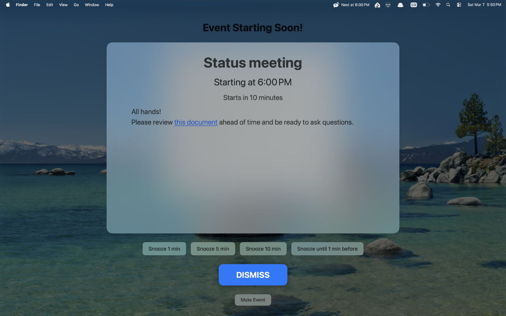
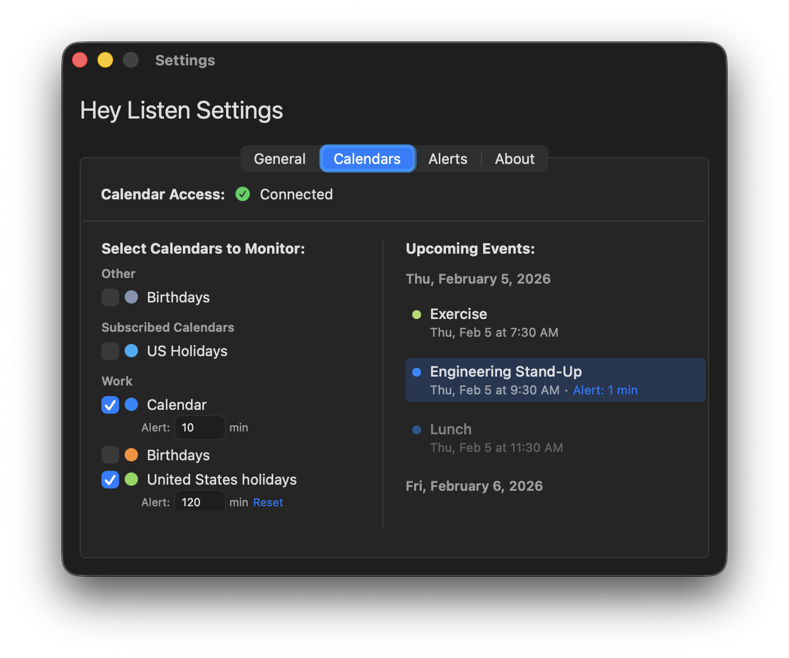

# Hey Listen

**Full-screen calendar alerts you can't miss.**

Hey Listen is a macOS menu bar app that shows full-screen reminders before your calendar events start. It detects meeting links, supports flexible snooze options, and gives you granular control over which events alert you and when.

## Support

If you need help, have a feature request, or want to report a bug, please [open an issue](../../issues/new).

## Privacy

Hey Listen operates entirely offline. It accesses your calendar data locally and never transmits it. No accounts, no analytics, no tracking. Read the full [privacy policy](PRIVACY.md).
