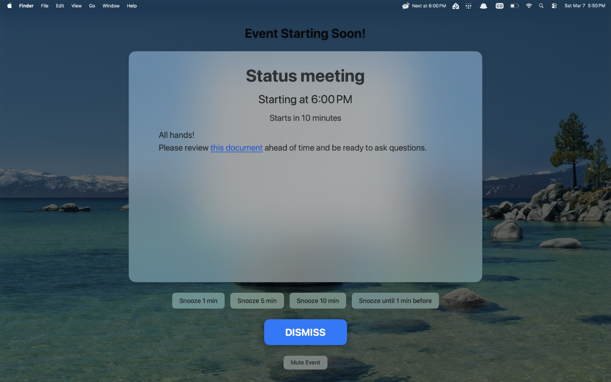
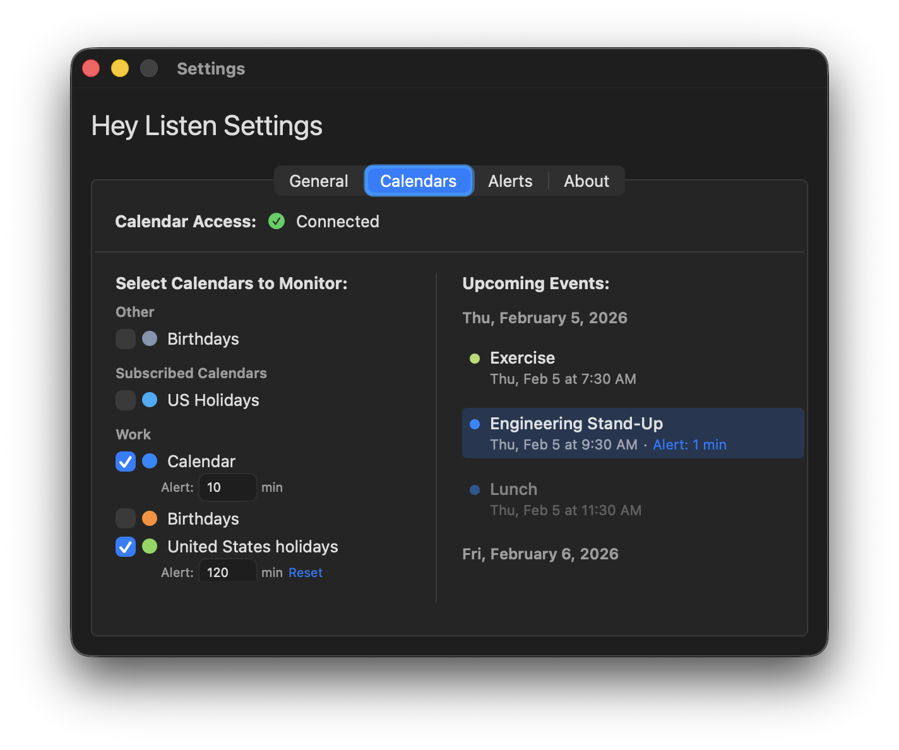

# Hey Listen

**Full-screen calendar alerts you can't miss.**

Hey Listen is a macOS menu bar app that shows full-screen reminders before your calendar events start. It detects meeting links, supports flexible snooze options, and gives you granular control over which events alert you and when.

## Features

- **Full-screen alerts** — hard-to-miss reminders appear at your configured lead time before events start
- **Meeting link detection** — join links are detected and shown prominently in the alert
- **Rich event descriptions** — event notes are rendered with formatting, and links are clickable
- **Menu bar event list** — see upcoming events directly from the menu bar icon, with one-click access to meeting links
- **Dynamic menu bar label** — optionally display time remaining until your next event, or its start time
- **RSVP filtering** — choose which events alert you based on your response status (accepted, tentative, unanswered, or declined)
- **Missed alert recovery** — if your Mac was asleep when an alert was due, it fires as soon as you wake up (as long as the event hasn't ended)
- **Focus restoration** — when you dismiss an alert, Hey Listen returns focus to whatever app you were using before
- **Flexible snooze** — snooze alerts and be reminded again closer to the event
- **Mute by title** — suppress alerts for recurring events you don't need reminders for
- **Alert preview** — demo what an alert looks like from the Settings window

## Support

If you need help, have a feature request, or want to report a bug, please [open an issue](../../issues/new).

## Privacy

Hey Listen operates entirely offline. It accesses your calendar data locally and never transmits it. No accounts, no analytics, no tracking. Read the full [privacy policy](PRIVACY.md).
